# Mergen1-Teknofest

Bu repo 27.04.2023-01.05.2023 tarihleri arasında gerçekleştirilmiş Teknofest Sağlıkta Yapay Zeka Kategori 1 için oluşturulmuştur. Bu repoda bireysel ve takımca yapılan çalışmalar yer alıyor.

Modellere alttaki drive linkinden ulaşabilirsiniz...

https://drive.google.com/drive/folders/1rVuUYy5U5lcsq10peIxFpLRPgUWnXvqi?usp=sharing

# Takım Üyeleri:
- **Mehmet Murat KÖSE - Takım Kaptanı** 
- **Sinem Çelik**  
- **Zeynep Aygün**  
- **Ertan Soyalp**  

## NOT
Çalışmamızın github hesabında teknofestin paylaşmaya izin vermediği fotoğraflar olduğundan dolayı fotoğrafları barındıran commitleri silmek amacıyla github hesabını tekrardan açtık. Kodlarımızda da fotoğrafları silmek zorunda kaldık fakat fotoğrafları direkt olarak barındırmayan maskeleri paylaştık. Önceki github hesabımızdaki istatistikleri ve katkıları altta görebilirsiniz...

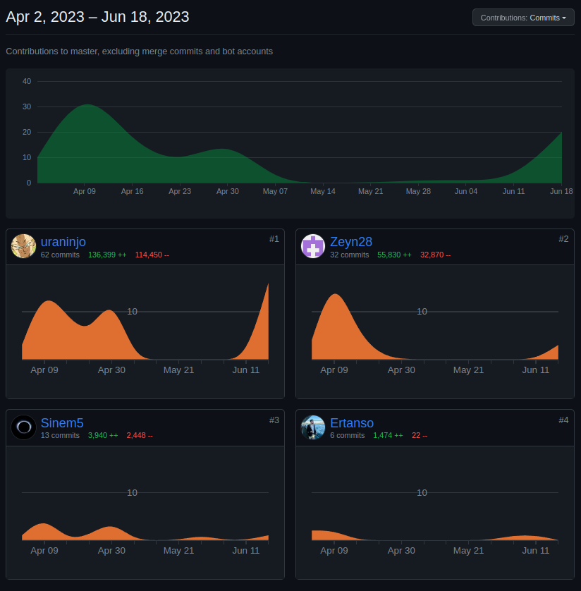

## Hatırlatma

**CC görüntüsü memenin üstten görüntülenmiş halidir.**

**MLO görüntüsü memenin yanlardan görüntülenmiş halidir**

## Kodlar Üzerine:
Kodlardaki dosya sisteminde,

* Genel: Yarışma boyunca kullanılan kodlar yer alıyor.
* -İsimler-: Bireysel çalışmalar yer alıyor.
* Hatalar: Kritik olabilecek hatalar yer alıyor. Çözülen hatalar yazılmamıştır.

## Segmentasyon

Segmentasyon yaklaşımımız “Pektoral Predicted Mask”, ”Meme Predicted Mask” ve “Meme Ucu Predicted Mask” olmak üzere üç farklı etiketleme işlemi şeklinde olup Teknofest tarafından verilen dicom görüntüleri ITK-SNAP üzerinden etiketlenmiştir. Verilen hastalardan 110 hasta, her hastada dört görüntü, toplamda 440 dicom görüntüsünü etiketlendikten sonra bu verilerle mimarisi özelleştirilmiş bir Unet modeli eğitilmiştir. Sonuç istenilen düzeyde olmadığı için meme ucu ve meme etiketleri birleştirilerek tek bir etiket olarak model tekrar eğitilmiştir. Aşağıda modelin test datasetindeki sonuçları mevcuttur.

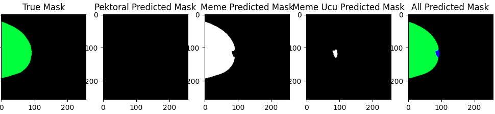

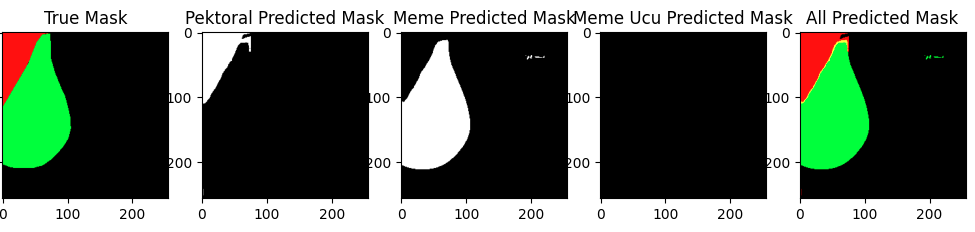

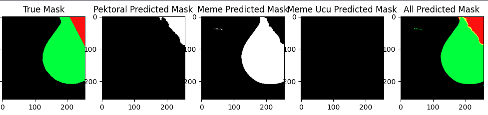

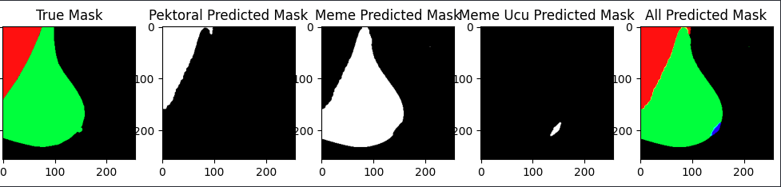

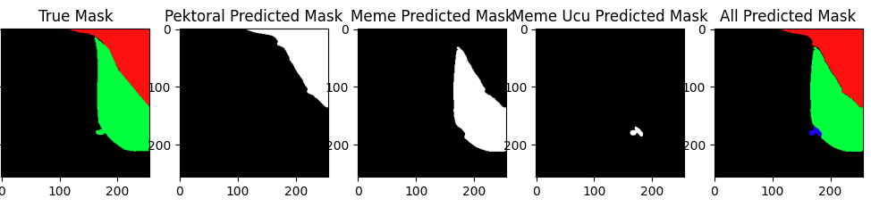

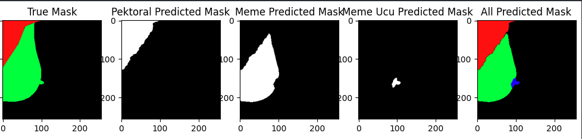

## Kadran Bulma

Kadran belirleme konusunda iki farklı çözüm sunmamız gerekiyordu. Bunun için çözümleri MLO ve CC görüntülerine özel bir şekilde hazırladık.

**CC görüntüleri için olan yaklaşımımız,**

* Segmentasyon modelinden çıkan meme ucu maskesinin orta noktasını tespit etmek
* Segmentasyondan sonra memenin çıkan en büyük kontörünü aldığımızdaki en uç noktayı bulmak

**MLO görüntüleri için olan yaklaşımımız,**

* Segmentasyon modelinden çıkan meme ucu maskesinin orta noktasını tespit etmek
* Segmentasyondan sonra memenin çıkan en büyük kontörünü aldığımızdaki en uç noktayı bulmak
* Pektoralin en alttaki noktasını bulmak

İki işlem de kadranı belirleme için yapılmıştır. Amaç memenin orta başlangıç noktasından meme ucuna çizilen çizginin bizim için bir kadran ayırıcı görevi görmesidir.

### MLO
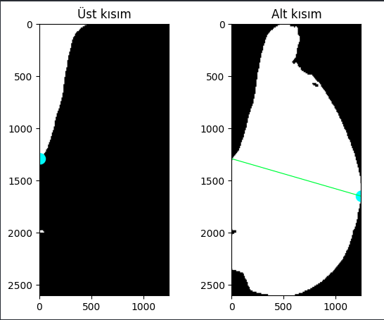

### CC
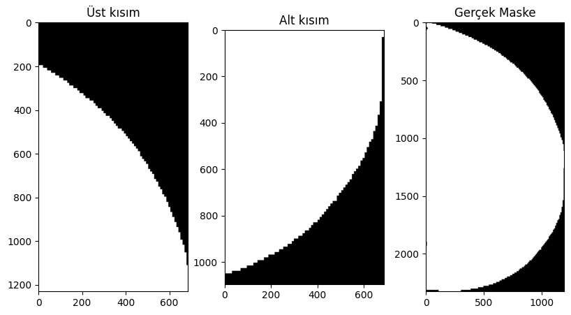

## BIRADS ve Kompozisyon Sınıflandırma

Altta, kullandığımız modellerde aldığımız en iyi sonuçlar yer almaktadır. Yarışmada da bu modeller kullanılmıştır...

### BIRADS Sınıflandırma EfficientNet-B0 Confusion Matrix
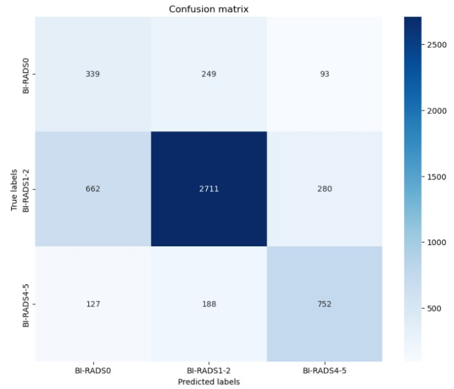

### Kompozisyon Sınıflandırma DenseNet121 Confusion Matrix
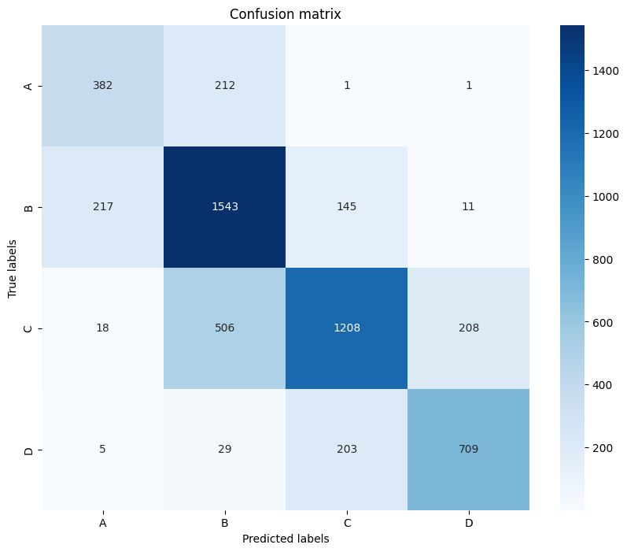

